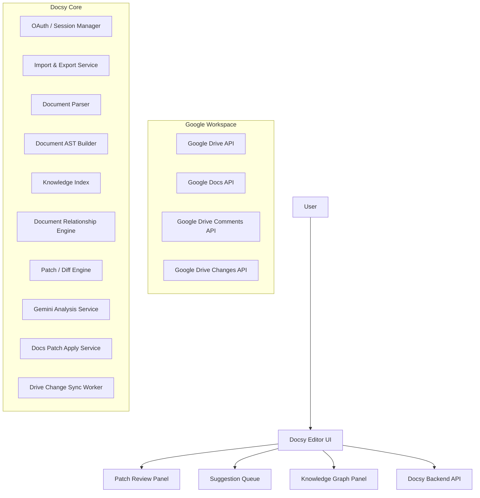

# Docsy Workspace Integration Design Pack
## Scope: Phase 1–2 (Drive Integration + Document Maintenance Agent)
Date: 2026-03-11

---

## 1. System Architecture Diagram



---

## 2. API Design Overview

### OAuth

POST /api/auth/google/connect

Response
```
{
  "authUrl": "https://accounts.google.com/..."
}
```

---

### Import Document

POST /api/workspace/import

```
{
  "fileId": "drive_file_id"
}
```

Response

```
{
  "documentId": "docsy_doc_001",
  "title": "Etch Process SOP"
}
```

---

### Generate Patch

POST /api/patches/generate

```
{
  "issueId": "issue_001"
}
```

---

### Apply Patch to Google Docs

POST /api/patches/apply

```
{
  "patchId": "patch_001",
  "targetFileId": "drive_doc_id"
}
```

---

## 3. Database Schema (Simplified)

### documents

| column | type |
|------|------|
| id | uuid |
| title | text |
| source_file_id | text |
| created_at | timestamp |

### document_snapshots

| column | type |
|------|------|
| id | uuid |
| document_id | uuid |
| ast_json | jsonb |
| created_at | timestamp |

### analysis_issues

| column | type |
|------|------|
| id | uuid |
| issue_type | text |
| severity | text |
| created_at | timestamp |

### patches

| column | type |
|------|------|
| id | uuid |
| issue_id | uuid |
| operations_json | jsonb |
| status | text |

---

## 4. 1 Week Implementation Plan

Day 1
- Google OAuth
- Drive API integration

Day 2
- Document import
- AST parsing

Day 3
- Multi-document relationship detection

Day 4
- Patch generation

Day 5
- Patch review UI

Day 6
- Google Docs batchUpdate integration

Day 7
- Drive change sync
- Demo preparation

---

## 5. Product Positioning

Docsy is a **document maintenance agent** that:

- imports documents from Google Drive
- detects cross-document inconsistencies
- generates review-first AI patches
- safely applies patches back to Google Docs
