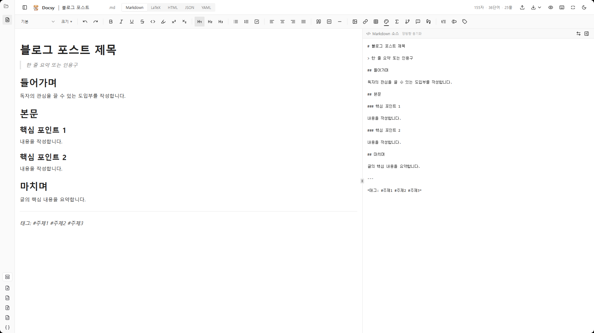

# Markdown Muse

언어: [한국어](README.ko.md) | [English](README.en.md)

Markdown Muse는 rich-text 편집, `.docsy` 저장 포맷, `Document AST`,
reviewable patch를 중심으로 구성된 local-first 기술 문서 편집기입니다.

`Markdown`, `LaTeX`, `HTML`, `JSON`, `YAML`, `AsciiDoc`,
`reStructuredText`를 지원하며, AI 결과를 문서에 직접 삽입하지 않고
검토 가능한 patch set으로 다루는 워크플로를 사용합니다.



## 주요 기능

- 탭과 파일 사이드바 기반 다중 문서 편집
- `Markdown`, `LaTeX`, `HTML` rich-text 편집
- `JSON`, `YAML` structured editing
- local autosave와 세션 복원
- richer editor state를 보존하는 `.docsy` 저장/복원
- `Document AST` 직렬화, 렌더링, 검증, patch 적용
- 요약, 섹션 생성, 비교, 업데이트 제안, 절차 추출을 포함한 review-first AI 워크플로
- 정규화된 문서 chunk 검색이 가능한 local knowledge index
- `Markdown`, `LaTeX`, `HTML`, `Typst`, `AsciiDoc`,
  `reStructuredText`, `JSON`, `YAML`, `PDF` 입출력
- Mermaid, 수식, 표, admonition, 각주, caption, cross reference 지원
- `ko/en` UI i18n

## 제품 모델

Markdown Muse는 단순한 텍스트 편집기가 아닙니다.

현재 구현은 다음 모델을 따릅니다.

- source format은 import/export 표면이다
- `.docsy`는 richer state를 보존하는 persistence format이다
- `Document AST`는 canonical structured representation이다
- AI 결과는 reviewable patch set으로 변환된다
- 사용자가 변경 사항을 검토한 뒤 accept, reject, edit를 결정한다

## 핵심 구성

### 편집

- `Markdown`, `LaTeX`, `HTML` rich-text editing
- `JSON`, `YAML` structured editing
- 모드 전환과 format conversion
- rich text와 plain text editor용 find/replace

### AI와 Patch Review

- 출처 정보가 포함된 AI 요약
- Patch Review로 연결되는 섹션 생성
- 문서 비교 preview
- Patch Review로 연결되는 업데이트 제안
- 현재 문서 기준 procedure extraction
- rich-text와 structured document 모두를 다루는 Patch Review

### Knowledge Layer

- 열어본 문서와 import 문서를 대상으로 하는 local knowledge index
- IndexedDB 우선, localStorage fallback 저장소
- section/chunk 단위 knowledge search
- import 파일 provenance 보존

### Structured Data

- JSON/YAML schema-aware editing surface
- `structured_path` 기반 structured patch 적용
- structured patch에 대한 안전한 review flow

## 아키텍처 개요

### UI Layer

- `src/components/editor`
- `src/pages`
- `src/i18n`

이 레이어에는 편집기 UI, dialog, toolbar, preview, sidebar, 번역 문자열이
들어 있습니다.

### State and Workflow Layer

- `src/hooks/useDocumentManager.ts`
- `src/hooks/useEditorUiState.ts`
- `src/hooks/useFormatConversion.ts`
- `src/hooks/useDocumentIO.ts`
- `src/hooks/useAiAssistant.ts`
- `src/hooks/usePatchReview.ts`
- `src/hooks/useKnowledgeBase.ts`

이 훅들은 문서 상태, UI 상태, format conversion, file IO, AI action,
patch review, local knowledge indexing을 조율합니다.

### Domain Layer

- `src/lib/ast`
- `src/lib/docsy`
- `src/lib/patches`
- `src/lib/ai`
- `src/lib/ingestion`
- `src/lib/retrieval`
- `src/lib/knowledge`

이 레이어는 AST 변환, `.docsy` persistence, patch 검증과 적용, AI
orchestration, ingestion normalization, retrieval, knowledge indexing을
담당합니다.

### Server Layer

- `server/aiServer.ts`

Gemini 요청은 브라우저에서 직접 보내지 않고 local Node proxy를 통해
처리합니다.

## 프로젝트 구조

```text
.
|- docs/                      # 세션 요약과 로드맵 문서
|- PRD/                       # 제품 및 아키텍처 문서
|- public/
|- server/                    # Gemini proxy server
|- src/
|  |- assets/
|  |- components/
|  |  |- editor/             # editor UI, dialog, extension, preview
|  |  |- ui/                 # shared shadcn/ui components
|  |- hooks/                 # state, workflow, AI, IO, knowledge hooks
|  |- i18n/                  # translations and provider
|  |- lib/
|  |  |- ai/
|  |  |- ast/
|  |  |- docsy/
|  |  |- ingestion/
|  |  |- knowledge/
|  |  |- patches/
|  |  |- rendering/
|  |  |- retrieval/
|  |- pages/
|  |- test/
|  |- types/
|- .env.example
|- package.json
`- README.md
```

## 지원 포맷

### Import / Open

- `.docsy`
- `.md`
- `.markdown`
- `.txt`
- `.tex`
- `.html`
- `.htm`
- `.json`
- `.yaml`
- `.yml`
- `.adoc`
- `.asciidoc`
- `.rst`

### Export

- Markdown
- LaTeX
- HTML
- JSON
- YAML
- Typst
- AsciiDoc
- reStructuredText
- 브라우저 print 기반 PDF

## `.docsy` 포맷

`.docsy`는 애플리케이션 전용 persistence format입니다.

일반 source format보다 더 많은 상태를 보존하도록 설계되어 있습니다.

- document metadata
- TipTap JSON
- `Document AST`
- mode별 source snapshot
- autosave recovery state

Markdown나 LaTeX 같은 source format도 여전히 중요하지만, `.docsy`는
save/restore 과정에서 상태 손실을 최소화하기 위한 포맷입니다.

## Local Knowledge와 AI

AI와 retrieval 흐름은 review-first, local-first를 최대한 유지합니다.

- 클라이언트가 editor content와 normalized retrieval context를 준비함
- local AI server가 Gemini 요청을 proxy함
- 생성 결과는 summary 또는 patch set으로 반환됨
- patch set은 적용 전에 반드시 review를 거침
- 열어본 문서와 import 문서가 local knowledge store에 색인됨

관련 경로:

- `src/components/editor/AiAssistantDialog.tsx`
- `src/components/editor/PatchReviewDialog.tsx`
- `src/components/editor/PatchReviewPanel.tsx`
- `src/components/editor/KnowledgeSearchPanel.tsx`
- `src/hooks/useAiAssistant.ts`
- `src/hooks/usePatchReview.ts`
- `src/hooks/useKnowledgeBase.ts`
- `src/lib/ai`
- `src/lib/knowledge`
- `server/aiServer.ts`

## 시작하기

### 요구 사항

- Node.js 18 이상
- npm

### 설치

```bash
npm install
```

### 앱 실행

```bash
npm run dev
```

기본 Vite 개발 서버는 `http://localhost:8080`에서 실행됩니다.

### AI 서버 실행

1. 로컬 환경 파일을 만듭니다.

```bash
cp .env.example .env.local
```

Windows PowerShell:

```powershell
Copy-Item .env.example .env.local
```

2. `.env.local`을 설정합니다.

- `GEMINI_API_KEY`
- `GEMINI_MODEL` 기본값: `gemini-2.5-flash`
- `AI_SERVER_PORT` 기본값: `8787`
- `AI_ALLOWED_ORIGIN` 기본값: `http://localhost:8080`
- `VITE_AI_API_BASE_URL` 기본값: `http://localhost:8787`

3. AI 서버를 시작합니다.

```bash
npm run ai:server
```

4. 다른 터미널에서 프론트엔드를 실행합니다.

```bash
npm run dev
```

## 스크립트

- `npm run dev` - Vite 개발 서버 실행
- `npm run build` - 프로덕션 빌드
- `npm run build:dev` - 개발 모드 빌드
- `npm run preview` - 프로덕션 빌드 미리보기
- `npm run lint` - ESLint 실행
- `npm run test` - Vitest 실행
- `npm run test:watch` - Vitest watch 모드
- `npm run ai:server` - Gemini proxy server 실행
- `npm run typecheck:server` - 서버 타입 체크

## 테스트 범위

테스트는 `src/test/`에 있으며 현재 다음 영역을 다룹니다.

- format conversion과 round-trip 동작
- AST rendering과 validation
- `.docsy` file format과 autosave migration
- patch parsing, review, apply
- structured patch apply
- ingestion normalization
- retrieval contract와 vector store
- 일부 editor UI 동작

대표 테스트 파일:

- `src/test/docsyFileFormat.test.ts`
- `src/test/docsyAutosaveMigration.test.ts`
- `src/test/docsyRichTextRoundtrip.test.ts`
- `src/test/applyDocumentPatch.test.ts`
- `src/test/applyStructuredPatchSet.test.ts`
- `src/test/reviewPatchSet.test.ts`
- `src/test/compareDocuments.test.ts`
- `src/test/knowledgeIndex.test.ts`
- `src/test/normalizeIngestionRequest.test.ts`
- `src/test/patchReviewPanel.test.tsx`

## 문서

### docs

- [2026-03-09 Session Summary](docs/session-summary-2026-03-09.md)
- [2026-03-09 Docsy Storage Update](docs/session-summary-2026-03-09-docsy.md)
- [2026-03-09 Engineering Update](docs/session-summary-2026-03-09-engineering-update.md)
- [2026-03-09 Feasible Roadmap](docs/prd-feasible-implementation-roadmap-2026-03-09.md)
- [2026-03-09 Roadmap Execution Summary](docs/session-summary-2026-03-09-roadmap-execution.md)

### PRD

- [Execution Plan v0.1](PRD/docsy_execution_plan_v0.1.md)
- [Issue Backlog v0.1](PRD/docsy_issue_backlog_v0.1.md)
- [Document AST Design Spec v0.1](PRD/docsy_document_ast_design_spec_v0.1.md)

## 보안 메모

- `GEMINI_API_KEY`는 브라우저 번들에 포함되지 않습니다
- Gemini 호출은 `server/aiServer.ts`를 통해 처리됩니다
- 프론트엔드는 document payload만 proxy로 보내고, 비밀 값은 서버 환경 변수로
  관리됩니다
