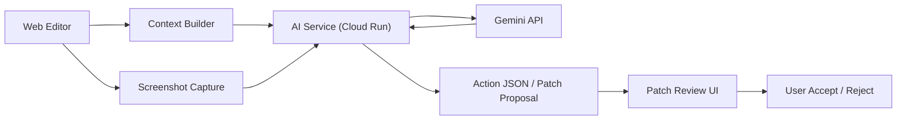

# Docsy Hackathon Architecture

## Goal

This architecture is optimized for the hackathon demo path:

1. the user edits a document
2. the app gathers document context and UI state
3. the AI service sends structured multimodal context to Gemini
4. Gemini returns action JSON or patch data
5. the UI opens review-first patch workflows

## System diagram

## Components

### Web Editor

- built with React and Vite
- provides document editing, tabs, sidebar, and patch review UI
- owns the current document content, headings, and workspace state

### Context Builder

- collects active document markdown
- collects document structure metadata
- prepares request payloads for the AI service
- in the next phase, includes screenshot payloads for multimodal prompts

### Screenshot Capture

- captures the current editor or workspace view
- sends image data to the AI service
- provides visible UI context for Gemini

### AI Service

- runs as a separate Node service
- deployed to Cloud Run
- owns Gemini API access
- validates request payloads and response schemas
- returns structured JSON instead of free-form prose

### Gemini API

- analyzes document content and UI context
- returns structured actions and grounded patch suggestions
- is accessed through the Google GenAI SDK gateway

### Patch Review UI

- receives AI-produced action data
- opens a review flow instead of mutating documents directly
- keeps the user in control of accepting or rejecting changes

## Request flow

1. The editor collects the active document text.
2. The editor collects structural metadata such as headings.
3. The frontend optionally captures a screenshot.
4. The frontend sends the payload to the AI service.
5. The AI service builds a Gemini prompt and response schema.
6. Gemini returns structured JSON.
7. The frontend maps the returned action to a UI behavior.
8. The patch review dialog opens for user approval.

## P0 scope

- Google GenAI SDK integration
- Cloud Run deployment
- repo and documentation cleanup
- architecture diagram
- demo script

## P1 scope

- screenshot upload
- multimodal prompt
- action JSON output
- one real UI action wired from AI output

## P2 scope

- related document suggestions
- conflict highlighting
- TOC auto suggestion
- before/after patch diff cards
