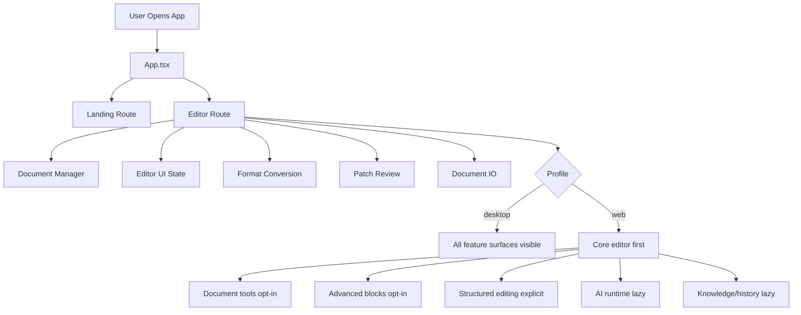
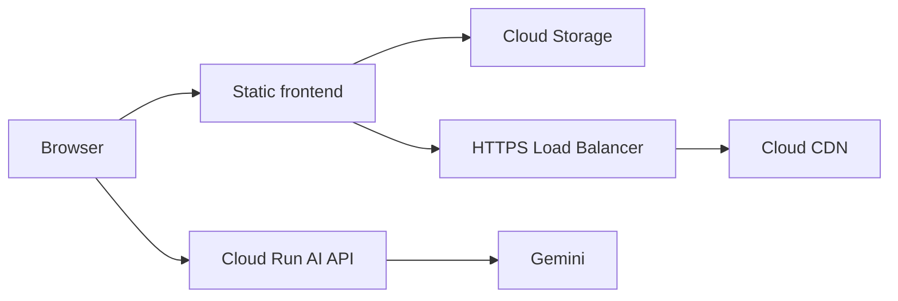

# Architecture Overview

Date: 2026-03-10

## Purpose

This document summarizes the current Markdown Muse runtime structure after the
desktop/web profile split and the recent editor loading optimizations.

## High-Level Model

Markdown Muse is organized around four ideas:

- source formats are import and export surfaces
- `.docsy` is the richer persistence format
- `Document AST` is the canonical structured representation
- AI output is reviewed as patch sets before application

## Runtime Profiles

There are two runtime profiles:

- `desktop`
  Full feature visibility by default
- `web`
  Lighter default route with heavy features enabled on demand

The active profile is resolved from `VITE_APP_PROFILE`.

## Application Flow

## Editor Capability Layers

The rich-text editors are split into three capability tiers.

### 1. Core

Loaded by default in the web editor route.

- text
- headings
- bullet and ordered lists
- task list
- blockquote
- inline code
- link
- basic text styles

### 2. Document

Loaded when explicitly enabled or when a document already contains matching
nodes.

- code block UI
- horizontal rule
- image
- table
- caption
- cross-reference
- footnote
- admonition
- TOC placeholder
- font controls

### 3. Advanced

Loaded when explicitly enabled or when a document already contains matching
nodes.

- math
- mermaid

## Main Layers

### UI Layer

- `src/components/editor`
- `src/pages`
- `src/i18n`

Responsible for route rendering, editor chrome, dialogs, sidebars, and
localized strings.

### Workflow Layer

- `src/hooks/useDocumentManager.ts`
- `src/hooks/useEditorUiState.ts`
- `src/hooks/useFormatConversion.ts`
- `src/hooks/useDocumentIO.ts`
- `src/hooks/usePatchReview.ts`
- `src/hooks/useVersionHistory.ts`
- `src/hooks/useKnowledgeBase.ts`

Coordinates document lifecycle, editor state, file IO, patch handling, version
history, and knowledge indexing.

### Domain Layer

- `src/lib/ast`
- `src/lib/docsy`
- `src/lib/patches`
- `src/lib/ai`
- `src/lib/knowledge`
- `src/lib/ingestion`
- `src/lib/retrieval`

Handles canonical document structure, serialization, AI workflows, comparison,
knowledge indexing, and patch application.

### Server Layer

- `server/aiServer.ts`

Provides the Gemini proxy used by the web client and deployment flow.

## Lazy Boundaries

The current lazy loading strategy is intentionally asymmetric.

### Web-first lazy boundaries

- AI runtime
- knowledge panels
- history panels
- structured editor
- share dialog
- document tools
- advanced tools
- math render path
- mermaid render path

### Desktop behavior

Desktop keeps the full feature set visible by default, but internal lazy loading
is allowed where it does not remove capabilities from the UI.

## Persistence

There are two persistence paths:

- autosave
  Stores `DocumentData` directly for fast local recovery
- `.docsy`
  Stores richer state for explicit save/export/share scenarios

This keeps frequent autosave cheaper while preserving the richer portable format.

## Deployment Topology

The recommended production deployment keeps the browser bundle and the AI API
separate.

Recommended roles:

- Cloud Storage
  Hosts `dist/` from `npm run build:web`
- HTTPS Load Balancer
  Handles SPA routing and public HTTPS termination
- Cloud CDN
  Caches hashed frontend assets
- Cloud Run
  Runs `server/aiServer.ts` as the Gemini proxy

The key separation is:

- web profile frontend is static
- AI traffic is handled by the proxy service
- desktop profile is not part of the GCP frontend deployment path

## Optimization Timeline

### Phase 1: route-level splitting

- introduced `desktop` / `web` runtime profiles
- moved knowledge, history, AI, share, patch review, and structured editing
  behind lazy boundaries
- added bundle reporting and GCP deployment docs

### Phase 2: web-first capability reduction

- web default mode switch reduced to rich-text modes
- structured editing moved behind explicit entry
- advanced blocks moved behind explicit entry
- smaller landing/header assets introduced

### Phase 3: editor capability layering

- editor split into `core`, `document`, and `advanced` capability tiers
- document tools became independent from advanced blocks
- desktop preserved full feature visibility while allowing internal lazy loading

### Current state

- web starts light and escalates capabilities only when needed
- desktop keeps the full editing surface visible
- remaining large cost is mostly third-party vendor size, not app shell size

## Current Bottlenecks

The largest remaining client costs are still:

- `tiptap-vendor`
- `math-vendor`
- `mermaid.core`
- shared AST/docsy helpers that remain close to the editor route

## Related Docs

- [Web performance optimization summary](session-summary-2026-03-10-web-performance-optimization.md)
- [GCP deployment guide](gcp-deployment.md)
